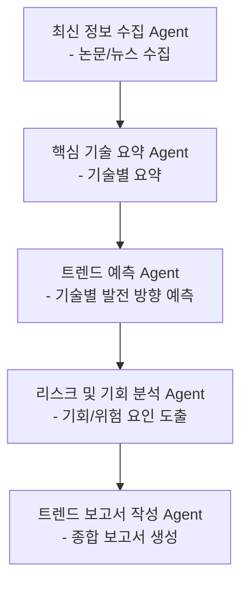

# tech-trend-AI

# 미래 기술 트렌드 분석 AI 에이전트 프로젝트

본 프로젝트는 향후 5년간 AI 기반 미래 기술 트렌드를 예측하고 보고서를 자동 생성하는 멀티 에이전트 시스템을 설계 및 구현한 실습 프로젝트입니다.

## Overview

- Objective : AI, 로보틱스, 에너지, 생명과학 분야를 중심으로 향후 5년간 유망한 기술 트렌드를 예측하고 보고서 형태로 제공
- Methods : Prompt Engineering, Agentic Workflow, RAG (Retrieval-Augmented Generation)
- Tools : LangGraph, LangChain, ChromaDB, Python, OpenAI API

## Features

- 최신 논문/뉴스를 수집하고 요약
- 분야별 핵심 기술과 트렌드 분석
- 시장 적용 가능성과 리스크 요인 평가
- 정량 데이터 기반 트렌드 예측 (논문 수, 검색량 등)
- 자동 보고서 생성 기능

## Tech Stack

| Category | Details |
| --- | --- |
| Framework | LangGraph, LangChain, Python |
| LLM | GPT-4o-mini via OpenAI API |
| Retrieval | ChromaDB |

## Agents

- 최신 정보 수집 에이전트 : 뉴스 및 논문 API를 통해 주요 기술 정보를 수집
- 핵심 기술 요약 에이전트 : 수집한 데이터를 기술별로 정리 및 요약
- 트렌드 예측 에이전트 : 데이터 기반으로 기술 발전 방향 예측
- 리스크 및 기회 분석 에이전트 : 예상 트렌드에 대한 리스크와 기회 분석
- 트렌드 보고서 작성 에이전트 : 분석 결과를 종합하여 보고서 작성

## State

- `raw_data` : 논문/뉴스 원문
- `tech_summaries` : 기술별 핵심 내용 요약
- `trend_forecast` : 기술 트렌드 예측 결과(향후 5년 트렌드 예측 결과)
- `risk_opportunity` : 기술별 기회/위험 요인 분석
- `report_output` : 최종 보고서 (요약 포함)

## Architecture

## Directory Structure

├── data/                  # 수집된 논문 및 뉴스

├── agents/                # 각 Agent 스크립트

│   ├── fetch_agent.py

│   ├── summary_agent.py

│   ├── predict_agent.py

│   ├── risk_agent.py

│   └── report_agent.py

├── prompts/               # 프롬프트 템플릿

├── outputs/               # 보고서 출력 결과

├── app.py                 # 실행 스크립트

└── README.md

## Contributors

- 박정의 : 전체 설계, Prompt Engineering, Graph Architecture 설계
